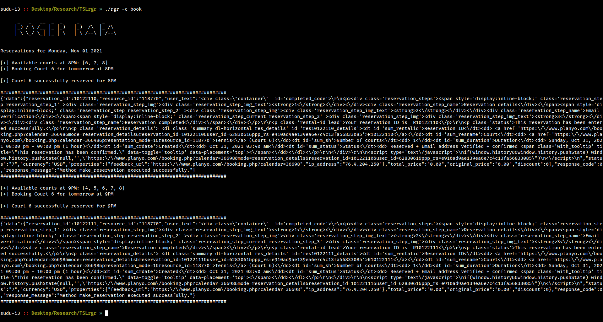

# Roger Rafa Fans Court Booking

## Usage

```
usage: Roger Rafa [options]

optional arguments:
  -h, --help         show this help message and exit
  -c CMD, --cmd CMD  check - Check availability tomorrow or book - Book available tomorrow (default=check)
  -n NO, --no NO     Number of courts to book (default=2)
```

## Example

Check availability of courts with following command:
```
$ ./RgrRafa OR $ ./RgrRafa -c check 

      _   _   __  _  _     _        _
     |_) / \ /__ |_ |_)   |_)  /\  |_ /\
     | \ \_/ \_| |_ | \   | \ /--\ | /--\

Reservations for Monday, Nov 01 2021

[+] Available courts at 6PM: [1, 2, 3, 4, 5, 6]
[+] Available courts at 7PM: [1, 2, 3, 4, 5, 6]
[+] Available courts at 8PM: []
[+] Available courts at 9PM: []
```

Book available courts with following command:
```
$ ./RgrRafa -c book
```


Enjoy! 😉
